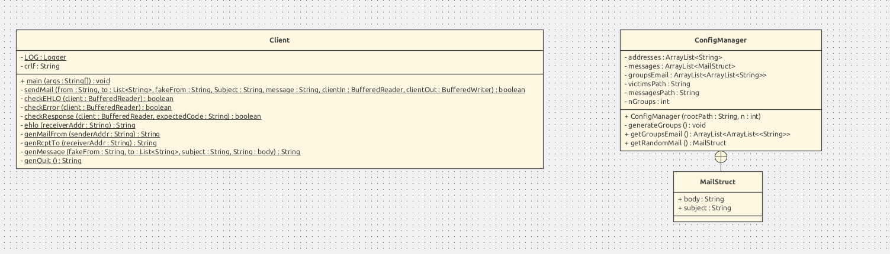
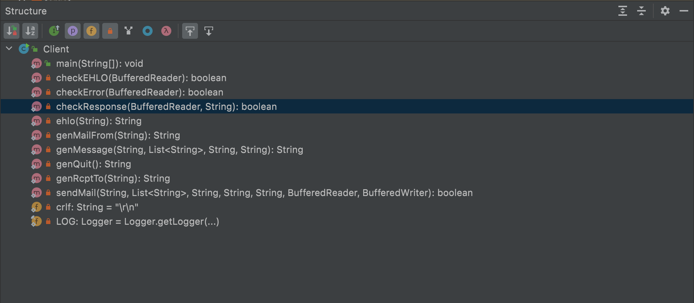
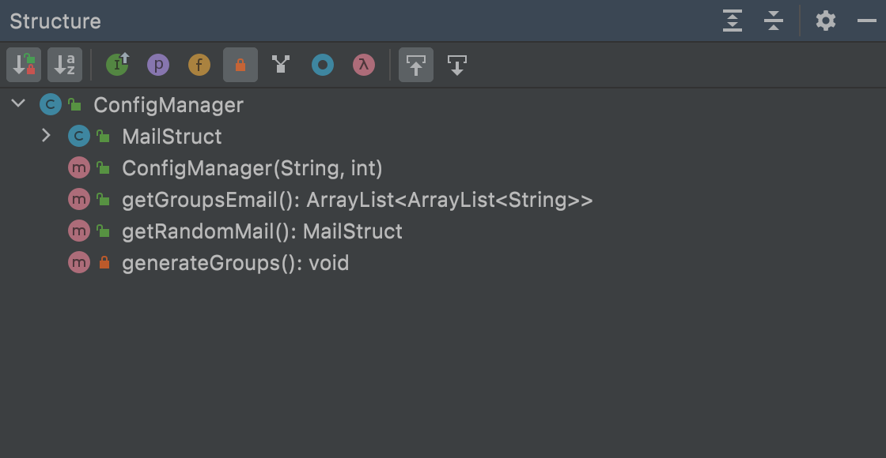

# API-LABO-SMTP BASILE CUNEO & JORIS SCHALLER 

## Description
Ce projet simule une campagne de fishing par email. 
Un serveur smtp est disponible à travers MockMock afin de ne pas générer de vrais emails.
Features:  
 - *définir une liste de victimes* 
 - *définir des messages*, 
 
Les messages sont envoyés par email aux victimes indiquées.

## Getting started 
Prérequis:
Docker, maven et java 11.
1. Cloner le projet MockMock disponible ici :https://github.com/HEIGVD-Course-API/MockMock ainsi que ce projet
```bash
git clone https://github.com/HEIGVD-Course-API/MockMock
git clone https://github.com/BasileCuneo/API-2021-SMTP
```
2. Compiler les projets et déplacer l'archive MockMock dans le répertoire API
```bash
cd MockMock && mvn clean package
cd ../API-2021-SMTP && mvn clean package
cp ../MockMock/target/MockMock-1.4.0.one-jar.jar .
``` 
3. Construire l'image docker 
```bash
DOCKER_BUILDKIT=1 sudo docker build -t mockmock .
#veillez à ne pas déjà avoir une image avec ce tag
```
4. Lancer le serveur MockMock
```bash
sudo docker run -d -p 8282:8282 -p 2525:25 mockmock
```
5. lancer un navigateur web et aller sur http://localhost:8282/
6. Configurer les victimes (lire la partie configuration), si aucune configuration n'est faite le serveur utilise les victimes par défaut.
7. Configurer les messages (lire la partie configuration), si aucune configuration n'est faite le serveur utilise les messages par défaut.
8. Lancer le client qui génère les emails de phishing en lui donnant en argumant le nombre de groupe de victimes
```bash
java -jar target/ClientSMTP-1.0.jar  <nGroup>
```
9. Vérifier que les emails ont bien été envoyés en regardant votre navigateur web.

# Notes
Pour faire un vrai email et non pas contacter un serveur smtp fictif (mockmock), il faut changer l'adresse ip du server
smtp dans le code et remettre le port a 25 et non 2525.

## Configuration du projet
### Ajouter des messages
Le répertoire contenant les différents fichiers de messages est le répértoire API-2021-SMTP/src/configuration/messages
Chaque message est configuré à partir d'un fichier .txt, il faut donc créer un nouveau fichier pour chaque nouveau message.

Concernant le format des fichiers contenant des messages, la première ligne constitue le sujet et le reste du fichier le corps du message.

Exemple de fichier de message:

<début du fichier>Ceci est le sujet
Ceci est le corps du message

Ceci est toujours le corps du message et le retour à la ligne fonctionne<Fin du fichier>

### Ajouter des victimes
Le fichier contenant la liste des victimes est le fichier API-2021-SMTP/src/configuration/victims.txt

Pour y ajouter une victime, il suffit d'ajouter une nouvelle ligne avec l'adresse email voulue.
Les adresses doivent être correcte, i.e. avec un @ et un .
### Définir le nombre de groupes de victimes
Le nombre de groupes est à renseigner en argument de la ligne de commande lors du lancement du client.

En reprenant ce qui a été dit plus tôt, pour exécuter l'application client, il faut se rendre dans le répertoire API-2021-SMTP et utiliser la commande java -jar target/ClientSMTP-1.0.jar  <nGroup>

## Description et points clés de l'implémentation.

Notre implémentation est séparée en deux parties: le Client et le configManager.

Voici un graphique UML illustrant notre implémentation:




## Structure du client



La méthode checkEHLO permet de vérifier que le serveur répond correctement lors de l'envoi de la commande EHLO, il faut donc vérifier toutes les lignes qui commencent par 250- et terminer par la ligne qui commence par 250.

La méthode checkError permet de vérifier si une commande a été acceptée, en vérifiant le code de validation par défaut: 250

La méthode checkResponse permet de vérifier si une commande a été acceptée, mais en y passant en paramètre le code de réponse attendu.

Les méthodes ehlo, genMailFrom, genMessage, genQuit et genRcptTo gèrent les différentes strings à envoyer en commande lors de la communication avec le serveur SMTP, conformément à leur nom.

La méthode sendMail envoie au bufferedOutputStream le message à envoyer, ce dernier est composé a partir des fonctions
unitaires qui sont définies dans client.

## Structure du ConfigManager


Les différents fichiers de configuration sont lu dans le constructeur et les listes de victimes et de messages sont remplies
Les différentes listes sont ensuites mélangées et des groupes sont générés.
On peut récupérer les groupes grâce à la méthode getGroupsEmail et récupérer un email grâce à la méthode getRandomMail.